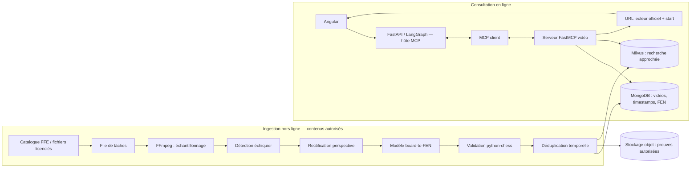

# Étude de faisabilité — recherche de positions dans des vidéos via MCP

**Projet :** Coach d'ouvertures FFE  
**Nature :** étude de conception, non implémentée dans le POC  
**Date de référence des coûts et politiques :** 31 août 2026  
**Horizon :** prototype de 3 mois, puis décision d'industrialisation

## 1. Résumé de décision

L'idée est techniquement faisable sur un catalogue limité et maîtrisé. Un pipeline peut échantillonner une vidéo, détecter l'échiquier, rectifier sa perspective, reconnaître les pièces, produire une FEN et indexer le timestamp. Un serveur MCP peut ensuite exposer une recherche par position à l'agent existant.

La recommandation est un **go conditionnel** pour un prototype sur 50 à 100 vidéos détenues ou explicitement licenciées par la FFE. Le principal verrou n'est pas le modèle de vision : c'est le droit d'obtenir et de traiter les images. Les [politiques développeur YouTube](https://developers.google.com/youtube/terms/developer-policies) interdisent le téléchargement, l'import, le cache ou le stockage de copies du contenu audiovisuel sans accord écrit préalable. Le projet ne doit donc pas aspirer arbitrairement des vidéos publiques. Trois voies acceptables sont proposées : utiliser des fichiers originaux fournis par la FFE et ses partenaires, obtenir des licences des créateurs, ou demander l'accord écrit de YouTube.

Pour l'index, une FEN normalisée est une clé structurée : une base documentaire ou relationnelle est plus simple et plus précise qu'une base vectorielle pour l'égalité exacte. Milvus garde une vraie utilité pour les recherches approchées : positions visuellement proches, même structure de pions, ou recherche sémantique dans les transcriptions. Cette architecture hybride évite de transformer toute donnée en vecteur par réflexe.

Budget indicatif : **22 000 à 38 000 € de construction** pour un prototype sérieux, puis **65 à 245 € par mois** pour un petit catalogue et une ingestion batch modérée, hors acquisition de droits, support métier et TVA. Une preuve de concept plus réduite, réalisée par une équipe étudiante sur 10 vidéos autorisées, peut utiliser l'infrastructure locale existante et coûter moins de 100 € de cloud.

## 2. Besoin et parcours utilisateur

Aujourd'hui, une recherche textuelle « ouverture sicilienne » retourne une vidéo entière. Le jeune joueur doit retrouver seul le passage correspondant à sa position. Le système cible un parcours plus direct :

1. l'application transmet la FEN courante ;
2. l'agent demande au serveur vidéo les occurrences proches ou exactes ;
3. le serveur retourne une vidéo, un timestamp et un score de confiance ;
4. l'interface ouvre le lecteur officiel au bon moment ;
5. l'utilisateur conserve le contrôle et peut consulter d'autres occurrences.

Le résultat attendu n'est pas « la vérité échiquéenne ». C'est une ressource pédagogique contextualisée. Un entraîneur doit pouvoir valider ou retirer une vidéo, corriger une orientation et ajouter un commentaire. Cette boucle éditoriale est aussi importante que le modèle.

## 3. Bénéfices attendus

### 3.1 Valeur pédagogique

- Réduction du temps entre la question et l'explication utile.
- Ancrage visuel : l'apprenant voit la même structure de pièces que sur son échiquier.
- Découverte de plans, pas seulement d'un coup moteur.
- Possibilité de comparer plusieurs explications et niveaux de difficulté.
- Réutilisation d'un catalogue FFE existant avec un accès plus fin.

### 3.2 Valeur produit

- Différenciation par rapport à une simple recherche YouTube.
- Recommandations explicables : vidéo, timestamp, FEN reconnue et confiance peuvent être affichés.
- Catalogue éditorial mesurable : positions couvertes, ouvertures sans contenu, passages les plus consultés.
- Découplage grâce à MCP : le même outil peut être appelé par LangGraph, une autre interface ou un assistant interne.

### 3.3 Valeur technique

- Traitement batch : une vidéo n'est analysée qu'à l'ingestion, pas à chaque demande.
- Cache naturel par FEN normalisée.
- Composants remplaçables : détecteur, modèle board-to-FEN, index et stockage peuvent évoluer séparément.
- Validation déterministe avec `python-chess` avant publication d'une position.

## 4. Architecture proposée

### 4.1 Vue d'ensemble



Les preuves visuelles ne doivent être conservées que pour des contenus dont les droits le permettent. Pour une vidéo YouTube non détenue, l'architecture ne télécharge aucune frame sans approbation écrite : elle se limite à l'API Data et au lecteur officiel.

### 4.2 Responsabilités des composants

| Composant | Responsabilité | Choix POC |
|---|---|---|
| Catalogue | droits, URL, langue, niveau, statut éditorial | MongoDB |
| Orchestrateur batch | reprise, parallélisme, journal d'erreurs | Celery/RQ ou service Python simple |
| Extraction | image à intervalle et détection de changements | FFmpeg + OpenCV |
| Détection | boîte de l'échiquier, éventuels échiquiers multiples | YOLO léger ou détecteur OpenCV |
| Rectification | quatre coins vers vue 8×8 | OpenCV homographie |
| Reconnaissance | classe vide/12 pièces sur 64 cases | modèle board-to-FEN |
| Validation | légalité minimale, rois, nombre de pièces | python-chess |
| Index exact | FEN normalisée → occurrences | index MongoDB composé |
| Index proche | structure/embedding → voisins | Milvus |
| Interface agent | outils typés et réponses bornées | FastMCP |

### 4.3 Modèle de données minimal

```text
video
  id, source, external_id, title, rights_status, language, duration_s
  source_url, owner, reviewed_at, active

occurrence
  video_id, timestamp_ms, fen_full, fen_board
  orientation, board_bbox, confidence
  detector_version, recognizer_version, reviewed
```

Deux formes de FEN sont utiles. `fen_full` conserve trait, roques, prise en passant et compteurs quand ils peuvent être inférés. `fen_board` ne conserve que le placement des pièces. Une image isolée ne permet généralement pas de connaître le droit de roque, la prise en passant ou le numéro du coup. La recherche doit donc annoncer si la correspondance porte sur le placement uniquement.

### 4.4 Contrat MCP

La [spécification MCP](https://modelcontextprotocol.io/specification/2025-06-18/architecture) repose sur une architecture hôte-client-serveur avec négociation de capacités. Le POC exposerait des outils en lecture seule :

- `search_position(fen, exact, limit, language)` : occurrences classées ;
- `get_video_segment(video_id, timestamp_ms)` : métadonnées et URL officielle ;
- `search_opening(query, limit)` : recherche sémantique complémentaire ;
- `report_bad_match(occurrence_id, reason)` : à réserver à un utilisateur authentifié.

Une ressource `catalogue://videos/{id}` peut exposer les métadonnées éditoriales. L'hôte FastAPI garde les décisions de consentement, d'authentification et de présentation. Le serveur MCP ne reçoit pas de clé YouTube côté navigateur.

Exemple de réponse bornée :

```json
{
  "query_kind": "board_placement",
  "matches": [
    {
      "video_id": "ffe-espagnole-01",
      "timestamp_ms": 192000,
      "url": "https://www.youtube.com/watch?v=...&t=192s",
      "confidence": 0.96,
      "reviewed": true
    }
  ]
}
```

## 5. Pipeline de vision

### 5.1 Échantillonnage raisonné

Extraire 25 images par seconde est inutile. Une première version peut :

1. échantillonner à 1 image/s ;
2. calculer un hash perceptuel ou une différence d'histogramme ;
3. supprimer les images presque identiques ;
4. lancer le détecteur seulement sur les candidates ;
5. conserver une occurrence lors d'un changement de position stable sur deux ou trois frames.

Cette stabilisation évite d'indexer le milieu d'une animation ou la main du présentateur. Pour un screencast numérique très stable, 0,2 à 0,5 image/s peut suffire. Pour une vidéo filmée, un rythme adaptatif est préférable.

### 5.2 Détection et rectification

Le détecteur doit distinguer l'échiquier principal d'un diagramme secondaire, d'une vignette ou d'une publicité. Une fois les coins trouvés, une homographie transforme le quadrilatère en carré. La qualité de cette étape conditionne fortement la classification des 64 cases.

Les cas difficiles sont : caméra inclinée, reflets, pièces fantaisie, coordonnées superposées, flèches colorées, plateau partiellement masqué, échiquier retourné et compression vidéo. Un jeu de validation FFE doit inclure ces variantes au lieu d'utiliser seulement des captures parfaites.

### 5.3 Reconnaissance et orientation

Le modèle produit 64 classes parmi vide, six pièces blanches et six pièces noires. L'orientation peut être prédite séparément, déduite des coordonnées visibles ou testée dans les quatre rotations. `python-chess` rejette les positions manifestement impossibles, mais une position légale n'est pas forcément la bonne : la confiance du modèle et la stabilité temporelle restent nécessaires.

Une correction humaine légère est recommandée. Un écran interne montre la frame, la FEN et le timestamp ; le relecteur corrige en déplaçant les pièces. Ces corrections alimentent ensuite le réentraînement.

### 5.4 Indexation exacte et approchée

La clé exacte peut être `sha256(fen_board_normalisée)`. Un index sur cette clé renvoie immédiatement les occurrences. Pour une recherche approchée, plusieurs distances sont envisageables : nombre de cases différentes, structure de pions, matériel, ou embedding appris. Le classement peut combiner :

```text
score = 0,55 × similarité_position
      + 0,20 × confiance_vision
      + 0,15 × validation_éditoriale
      + 0,10 × langue_et_niveau
```

Les poids doivent être évalués sur des requêtes réelles, pas choisis définitivement à partir de cette formule illustrative.

## 6. Limites et risques

### 6.1 Limites techniques

- Une image seule ne contient pas tous les champs d'une FEN complète.
- Les overlays et animations perturbent la reconnaissance.
- Les vidéos physiques sont beaucoup plus variables que les échiquiers numériques.
- Une position peut apparaître sans être expliquée ; le timestamp exact de l'image n'est pas nécessairement le début de l'explication.
- Une fréquence faible peut manquer une position brièvement affichée ; une fréquence forte augmente les coûts.
- Les changements de modèle nécessitent de réindexer ou de versionner les résultats.
- Une égalité de placement ne garantit pas le même contexte tactique si le trait ou les droits de roque diffèrent.

### 6.2 Limites pédagogiques

- Une vidéo populaire n'est pas automatiquement adaptée à un jeune espoir.
- Une explication peut employer une notation, une langue ou un niveau inadéquats.
- Le moteur et la fréquence historique ne remplacent pas la validation d'un entraîneur.
- Une réponse trop précise peut encourager la mémorisation au détriment des plans.

### 6.3 Risques juridiques et business

- **Risque majeur : droits vidéo.** Les politiques YouTube interdisent la copie audiovisuelle sans accord écrit. Le prototype doit partir de contenus possédés/licenciés.
- Les métadonnées et vidéos peuvent disparaître ou changer de visibilité.
- Une dépendance forte à une plateforme externe expose aux quotas et changements de politique.
- Les créateurs doivent être attribués et le lecteur officiel conservé.
- Le coût humain de la revue éditoriale peut dépasser le coût cloud.
- Les images de personnes et voix éventuelles imposent de documenter la base légale et les durées de conservation.

### 6.4 Sécurité

- Liste blanche des domaines et protection SSRF lors de l'ingestion.
- Authentification du serveur MCP distant et autorisations en lecture seule par défaut.
- Secrets dans un gestionnaire, jamais dans Angular ni dans les logs.
- Limites de taille/durée et antivirus sur les fichiers fournis.
- Journal d'audit pour ajout, correction et retrait d'une vidéo.
- Données de description et transcription considérées comme non fiables avant leur éventuelle injection dans un LLM.

## 7. Faisabilité économique

### 7.1 Hypothèses de dimensionnement

Scénario pilote : 100 vidéos autorisées de 30 minutes, soit 50 heures. À 1 frame/s, le pipeline voit 180 000 frames. La déduplication conserve environ 20 %, soit 36 000 candidates. Les fichiers vidéo sources représentent environ 30 Go selon l'encodage ; les crops et preuves retenus ajoutent 2 à 10 Go.

Les montants cloud sont des ordres de grandeur à revalider au moment de commander. Google affiche par exemple une VM `g2-standard-4` avec NVIDIA L4 autour de **0,7068 USD/h** dans une région de référence sur sa [page officielle de tarification des VM accélérées](https://cloud.google.com/products/compute/pricing/accelerator-optimized). Le stockage Standard Europe affiché sur la [tarification Cloud Storage](https://cloud.google.com/storage/pricing) est de l'ordre de quelques centimes par Gio et par mois. Le coût d'ingestion est donc dominé par l'ingénierie et la revue, pas par le stockage brut d'un petit pilote.

### 7.2 Coût de construction

| Lot | Charge | Hypothèse | Estimation |
|---|---:|---:|---:|
| Cadrage, droits, jeu d'évaluation | 5–8 j | 550 €/j | 2 750–4 400 € |
| Pipeline vidéo et reprise | 8–12 j | 550 €/j | 4 400–6 600 € |
| Détection/board-to-FEN et métriques | 12–18 j | 550 €/j | 6 600–9 900 € |
| Index, API et serveur MCP | 7–10 j | 550 €/j | 3 850–5 500 € |
| Interface de revue et intégration | 5–8 j | 550 €/j | 2 750–4 400 € |
| Tests, sécurité, documentation | 4–7 j | 550 €/j | 2 200–3 850 € |
| **Total prototype** | **41–63 j** | | **22 550–34 650 €** |
| Provision 10 % | | | **2 255–3 465 €** |
| **Budget conseillé** | | | **24 800–38 100 €** |

Le taux journalier est une hypothèse de planification, pas un tarif fournisseur. Une équipe interne ou étudiante réduit la dépense cash, mais pas le volume de travail ni le besoin de validation métier.

### 7.3 Coût mensuel d'exploitation pilote

| Poste | Bas | Haut | Commentaire |
|---|---:|---:|---|
| API/MCP et worker CPU | 25 € | 70 € | petite VM ou conteneur managé |
| MongoDB/index | 20 € | 80 € | mutualisable avec le POC |
| Stockage objet 40–100 Go | 2 € | 8 € | opérations incluses avec marge |
| GPU batch nouvelle ingestion | 5 € | 30 € | démarré uniquement à la demande |
| Logs, sauvegardes, supervision | 13 € | 57 € | dépend de la rétention |
| **Total mensuel** | **65 €** | **245 €** | hors support et droits |

Le quota YouTube est un autre plafond. Depuis la mise à jour 2026, la documentation indique un compartiment par défaut de **100 appels `search.list` par jour**, chaque appel coûtant une unité dans ce compartiment ; les pages supplémentaires consomment un appel. Voir le [calculateur de quota officiel](https://developers.google.com/youtube/v3/determine_quota_cost). Le cache MongoDB du POC réduit les recherches répétées.

### 7.4 Sensibilités

- Doubler le catalogue double approximativement l'ingestion et le stockage, mais pas le coût fixe de développement.
- Une revue humaine de 2 minutes par vidéo ajoute déjà plus de 3 heures pour 100 vidéos ; une revue occurrence par occurrence serait beaucoup plus chère.
- Conserver toutes les frames multiplie inutilement stockage et risque juridique.
- Une GPU allumée en permanence coûterait bien plus que le batch ; l'extinction automatique est indispensable.

## 8. Alternatives

### Alternative A — timestamps éditoriaux manuels

Un entraîneur saisit vidéo, ouverture, FEN et timestamp pour 20 à 50 passages majeurs. Coût technique très faible, qualité forte, couverture lente. C'est la meilleure base de comparaison et possiblement le meilleur MVP.

### Alternative B — analyse de contenus FFE uniquement

La FFE produit ou récupère les fichiers originaux de ses cours et autorise explicitement leur traitement. Cette solution minimise le risque de droits, permet le stockage de frames et facilite la correction. Le catalogue est plus petit mais maîtrisé.

### Alternative C — transcription et chapitres sans vision

Indexer titres, chapitres et transcriptions permet de retrouver une explication à coût réduit. La correspondance avec une FEN exacte est moins bonne, mais cette piste couvre les vidéos sans échiquier visible et aide à trouver le début réel de l'explication.

### Alternative D — traitement local à la demande

Un utilisateur propriétaire d'une vidéo fournit son fichier et reçoit un index privé. Le serveur évite de constituer un catalogue tiers. Cette option simplifie certains droits, mais augmente la latence et demande une politique d'effacement stricte.

La recommandation est de combiner A et B pour le MVP, puis d'ajouter C. La vision automatisée doit prouver un gain mesurable avant extension.

## 9. Roadmap et critères de passage

### Phase 0 — deux semaines

- Valider la politique de droits avec la FFE.
- Constituer 10 vidéos autorisées et 200 frames annotées.
- Définir les métriques et un protocole de revue.
- Réaliser un baseline manuel de timestamps.

**Passage :** droits documentés et jeu d'évaluation accepté.

### Phase 1 — quatre à six semaines

- Pipeline FFmpeg/OpenCV reproductible.
- Détection et board-to-FEN sur deux styles numériques.
- Index exact MongoDB et outil MCP `search_position`.
- Interface minimale de correction.

**Passage :** au moins 90 % de FEN-board exactes sur captures numériques, timestamp à ±5 s, aucune vidéo sans droit documenté.

### Phase 2 — quatre semaines

- Vidéos physiques et overlays.
- Milvus pour proximité et transcriptions.
- Monitoring, version des modèles et réindexation.
- Test utilisateur avec entraîneurs et jeunes joueurs.

**Passage :** 80 % des cinq premiers résultats jugés utiles, temps médian de réponse inférieur à 500 ms hors lecteur, baisse mesurée du temps de recherche.

### Phase 3 — décision production

- Audit sécurité et juridique.
- Estimation des coûts à l'échelle réelle.
- Procédure de retrait et synchronisation des vidéos supprimées.
- SLO, sauvegardes et responsable éditorial.

## 10. Protocole d'évaluation

Le jeu de test doit séparer échiquiers numériques, plateaux filmés, pièces fantaisie, overlays et rotations. Les métriques proposées sont :

- `board_detection_recall` : échiquiers retrouvés ;
- `square_accuracy` : cases correctement classées ;
- `exact_fen_board_rate` : placement entièrement correct ;
- `timestamp_error_seconds` : écart avec le passage annoté ;
- `precision@5` : pertinence des cinq premiers segments ;
- `review_minutes_per_video` : coût humain réel ;
- taux de positions sans résultat et par ouverture.

Une réussite sur la précision moyenne peut masquer des erreurs graves. Il faut publier la précision par catégorie et inspecter les faux positifs à forte confiance.

## 11. Conclusion

La recherche par position apporte une valeur pédagogique crédible et son coût cloud est modéré pour un pilote. L'architecture MCP est cohérente parce qu'elle isole un catalogue spécialisé derrière des outils typés, tout en laissant FastAPI/LangGraph contrôler le parcours utilisateur.

Le projet ne doit cependant pas commencer par aspirer YouTube. La première décision est juridique et éditoriale : sélectionner des contenus autorisés. Avec 10 à 100 vidéos FFE, un index exact MongoDB, une revue humaine et un outil MCP simple, le risque est contenu. Milvus et la vision avancée peuvent ensuite être ajoutés uniquement si les métriques montrent qu'ils améliorent réellement le service par rapport aux timestamps manuels et aux transcriptions.
