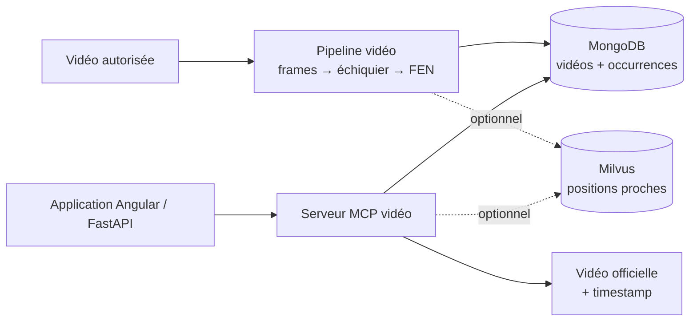

# Rapport d’étude — Recherche d’une position d’échecs dans des vidéos

## Coach d’ouvertures FFE — livrable stratégique

### Périmètre et lecture du POC

Ce rapport répond au complément de mission d’Alan : concevoir un système qui analyse des vidéos autorisées, détecte les échiquiers, reconnaît les positions et renvoie une ressource vidéo au timestamp pertinent via un serveur MCP. Cette fonctionnalité est étudiée, mais n’est pas à développer dans le POC de deux semaines.

Le POC existant démontre autre chose : une interface Angular, une API FastAPI, un workflow LangGraph déterministe, l’explorateur Lichess, Stockfish, Milvus, MongoDB et une recherche YouTube. Plus précisément :

- Milvus contient actuellement un corpus complet de 85 fiches d’ouvertures Wikichess, pas un index de positions vidéo ;
- MongoDB sert de cache des recherches YouTube, pas encore de catalogue vidéo ni de stockage d’occurrences FEN ;
- l’endpoint vidéo recherche par nom d’ouverture et non par FEN/timestamp ;
- aucun serveur MCP, extracteur de frames, détecteur d’échiquier ou modèle board-to-FEN n’est présent dans le code actuel.

La suite est donc une architecture cible et une étude de faisabilité, non la description d’une capacité déjà livrée.

## 1. Bénéfices attendus

### 1.1 Pour le jeune joueur

Une recherche textuelle sur « défense sicilienne » peut retourner une vidéo de 45 minutes alors que l’élève cherche l’explication d’une seule position. Une recherche par placement de pièces permettrait de proposer directement les passages où une position identique ou proche est affichée.

Un résultat pourrait contenir le titre et le lien officiel, le timestamp, la position reconnue, un score de confiance, la langue, le niveau et le statut de validation pédagogique. Le bénéfice attendu est la réduction du temps de recherche et un meilleur lien entre la question posée sur l’échiquier et l’explication proposée.

### 1.2 Pour la FFE et le produit

- catalogue pédagogique mesurable par positions couvertes ;
- réutilisation plus fine des contenus FFE et partenaires ;
- repérage des ouvertures ou positions sans ressource ;
- correction, validation et retrait par un entraîneur ;
- recommandation plus explicable qu’une simple recherche YouTube ;
- service spécialisé réutilisable par plusieurs interfaces et assistants.

Le traitement est effectué à l’ingestion : une vidéo déjà indexée n’est pas réanalysée à chaque question. Le moteur d’échecs garde sa responsabilité actuelle (« quel coup jouer ? ») et le service vidéo répond à « où voir une explication de cette position ? ».

## 2. Limites, droits et risques

### 2.1 Limites techniques

- Une image seule ne permet généralement pas de connaître le trait, les droits de roque, la prise en passant ni les compteurs de coups d’une FEN complète.
- La détection varie avec la perspective, les reflets, la compression, les animations, les flèches, les coordonnées et les mains devant le plateau.
- Les pièces et thèmes graphiques changent d’une vidéo à l’autre.
- Une vidéo peut afficher plusieurs échiquiers, un diagramme secondaire ou une vignette ; le plateau pertinent doit être distingué.
- Une position légalement valide peut tout de même être différente de l’image.
- Un échantillonnage trop lent manque des positions ; trop rapide, il augmente le coût et les doublons.
- L’apparition de la position n’est pas forcément le début de son explication orale.
- Une nouvelle version du modèle impose de versionner les résultats et, si nécessaire, de réindexer les occurrences.

### 2.2 Droits et sécurité

Le pilote doit commencer par des vidéos détenues par la FFE, fournies par ses partenaires ou explicitement licenciées. Il ne faut pas télécharger, conserver ou analyser des frames de vidéos publiques sans autorisation adaptée. Pour un contenu externe non autorisé, le service se limite au lien vers le lecteur officiel et aux métadonnées permises.

Le futur service doit prévoir une liste blanche de domaines, l’authentification du serveur MCP, des secrets côté serveur, des limites de taille et de durée, un antivirus pour les fichiers entrants, un journal d’audit et des droits de lecture seule par défaut. Les titres, transcriptions et descriptions externes doivent être traités comme des données non fiables avant toute injection dans un LLM.

### 2.3 Limites pédagogiques et business

Une vidéo populaire n’est pas forcément adaptée à un jeune joueur. La langue, le niveau, la longueur et la qualité de l’explication doivent être qualifiés éditorialement. Le coût de cette revue peut dépasser le coût du cloud. Les vidéos peuvent devenir privées, être supprimées ou changer d’URL ; les quotas et conditions des plateformes peuvent également évoluer.

## 3. Architecture technique cible



Ce schéma reste volontairement simple pour le POC. La file de tâches, le
stockage objet, la supervision et l’interface de revue sont des évolutions
possibles, mais ne sont pas indispensables pour démontrer la faisabilité.

### 3.1 Responsabilités

| Composant | Responsabilité | Choix de pilote |
|---|---|---|
| Catalogue | droits, URL, langue, niveau, statut | MongoDB |
| Orchestrateur batch | reprise, parallélisme, erreurs | service Python ou file simple |
| Extraction | frames et changements de scène | FFmpeg + OpenCV |
| Détecteur | boîte du plateau et plateaux multiples | modèle léger à annoter |
| Rectification | quadrilatère vers vue carrée 8×8 | homographie OpenCV |
| Reconnaissance | vide et 12 types de pièces | classifieur par case |
| Validation | rejet des positions manifestement impossibles | python-chess |
| Index exact | placement normalisé → occurrences | index MongoDB |
| Index approché | positions proches/transcriptions | Milvus, en seconde étape |
| Interface agent | outils typés et réponses bornées | serveur MCP dédié |
| Revue | correction, validation et retrait | écran interne |

Milvus n’est pas nécessaire pour l’égalité exacte d’un placement : MongoDB est plus simple et déterministe pour cette clé. Milvus conserve son intérêt pour la proximité de positions, les structures de pions ou la recherche sémantique dans les transcriptions.

### 3.2 Modèle de données

```text
video:
  id, source, external_id, title, rights_status, language, level,
  duration_s, source_url, owner, active, reviewed_at

occurrence:
  video_id, timestamp_ms, fen_board, fen_full,
  orientation, board_bbox, confidence,
  detector_version, recognizer_version, reviewed, review_note
```

`fen_board` contient le placement des pièces et constitue la valeur recherchée par défaut. `fen_full` ne doit être rempli que lorsque le trait et les autres champs sont établis par une source fiable. La réponse doit annoncer si la correspondance porte sur le placement seul. L’occurrence doit être dédupliquée par vidéo, position et intervalle temporel, pas seulement par FEN globale.

### 3.3 Contrat MCP proposé

Le serveur pourrait exposer, en lecture seule :

- `search_position(fen_board, exact, limit, language, level)` ;
- `get_video_segment(video_id, timestamp_ms)` ;
- `search_opening(query, limit)` pour la recherche complémentaire.

`report_bad_match(occurrence_id, reason)` serait réservé à un utilisateur authentifié et à la boucle de revue. L’hôte FastAPI conserve les décisions de consentement, d’authentification et de présentation ; aucune clé YouTube ne doit être envoyée au navigateur.

Réponse indicative :

```json
{
  "query_kind": "board_placement",
  "matches": [
    {
      "video_id": "ffe-espagnole-01",
      "timestamp_ms": 192000,
      "url": "https://www.youtube.com/watch?v=EXEMPLE&t=192s",
      "fen_board": "...",
      "confidence": 0.96,
      "reviewed": true
    }
  ]
}
```

Les outils doivent borner `limit`, valider la FEN, imposer une liste blanche pour les URL retournées et ne jamais permettre au modèle d’exécuter une action de téléchargement.

## 4. Faisabilité technique

### 4.1 Pipeline recommandé

1. échantillonner à environ une frame par seconde ;
2. éliminer les images quasi identiques par différence ou hash perceptuel ;
3. détecter le plateau et rectifier sa perspective ;
4. reconnaître les 64 cases et l’orientation ;
5. valider la position et la stabiliser sur deux ou trois frames ;
6. regrouper les occurrences consécutives et enregistrer le timestamp ;
7. faire valider un échantillon par un entraîneur.

Le modèle de départ peut produire 13 classes par case : vide, six pièces blanches et six pièces noires. Le détecteur et le reconnaisseur doivent être évalués séparément sur captures numériques, vidéos filmées, overlays et rotations. OpenCV peut assurer les contrôles géométriques ; un détecteur léger et un classifieur peuvent être entraînés sur des frames FFE annotées.

### 4.2 Dimensionnement pilote

100 vidéos de 30 minutes représentent 50 heures de contenu. À une frame par seconde, cela fait 180 000 frames. Si une déduplication conserve 20 % des images, environ 36 000 candidates restent à traiter. Les 30 Go de sources et 2 à 10 Go de crops ou preuves sont des ordres de grandeur dépendant du codec, de la résolution et de la politique de conservation ; ils ne mesurent pas le POC actuel.

### 4.3 Critères de validation

Il faut mesurer séparément : rappel et précision de détection, exactitude par case, taux de `fen_board` entièrement correcte, orientation, erreur de timestamp, précision@5 des résultats, temps/coût par heure et minutes de revue par vidéo. Une FEN valide ne suffit pas à prouver que l’image a été reconnue.

La première phase doit sélectionner dix vidéos autorisées, annoter environ 200 frames et produire un baseline manuel de timestamps. La recommandation est un **go conditionnel** pour un pilote de 50 à 100 vidéos autorisées, seulement si les faux positifs et la charge de revue restent acceptables.

## 5. Estimation des coûts

Ordres de grandeur hors TVA, droits vidéo, support métier et licences éventuelles. Hypothèse de planification : 550 € par jour.

### 5.1 Construction du prototype

| Lot | Charge | Estimation |
|---|---:|---:|
| Cadrage, droits et jeu d’évaluation | 5–8 j | 2 750–4 400 € |
| Pipeline vidéo et reprise sur erreur | 8–12 j | 4 400–6 600 € |
| Détection, board-to-FEN et métriques | 12–18 j | 6 600–9 900 € |
| Index, API et serveur MCP | 7–10 j | 3 850–5 500 € |
| Interface de revue et intégration | 5–8 j | 2 750–4 400 € |
| Tests, sécurité et documentation | 4–7 j | 2 200–3 850 € |
| **Sous-total** | **41–63 j** | **22 550–34 650 €** |
| Provision de risque de 10 % | — | **2 255–3 465 €** |
| **Budget conseillé** | — | **24 800–38 100 €** |

Cette estimation inclut la construction d’un vrai pipeline et une revue minimale ; elle ne correspond pas au coût de développement du POC déjà livré.

### 5.2 Fonctionnement mensuel du pilote

| Poste | Bas | Haut | Hypothèse |
|---|---:|---:|---|
| API/MCP et worker CPU | 25 € | 70 € | petite VM ou conteneur |
| MongoDB et index | 20 € | 80 € | mutualisation possible |
| Stockage objet | 2 € | 8 € | 40–100 Go |
| GPU pour ingestion batch | 5 € | 30 € | allumée à la demande |
| Logs, sauvegardes, supervision | 13 € | 57 € | selon rétention |
| **Total** | **65 €** | **245 €** | hors droits et support |

Le coût humain d’annotation, de correction et de qualification pédagogique est susceptible de devenir le premier poste. Une GPU permanente serait disproportionnée pour ce volume ; le traitement batch et l’arrêt automatique sont préférables. Ces montants cloud devront être recalculés auprès du fournisseur choisi avant engagement.

## 6. Alternatives et roadmap

### 6.1 Alternatives

| Option | Atout | Limite |
|---|---|---|
| Timestamps manuels | qualité contrôlée, coût technique faible | couverture lente |
| Contenus FFE uniquement | droits et styles maîtrisés | catalogue réduit |
| Transcriptions et chapitres | peu coûteux, trouve le début oral | pas de FEN exacte |
| Traitement local à la demande | pas de catalogue tiers permanent | latence et effacement à gérer |

L’option recommandée pour le MVP combine contenus FFE autorisés et timestamps manuels. La vision automatisée doit ensuite démontrer un gain mesurable par rapport à ce baseline.

### 6.2 Phases de mise en œuvre

**Phase 0 — cadrage, deux semaines**

- valider les droits et la conservation ;
- sélectionner dix vidéos et annoter 200 frames ;
- définir les métriques et le protocole de revue ;
- établir les timestamps manuels de référence.

**Phase 1 — pilote, quatre à six semaines**

- développer l’ingestion batch reproductible ;
- produire `fen_board` et timestamps ;
- indexer exactement dans MongoDB et exposer `search_position` ;
- intégrer une interface de correction ;
- mesurer précision, coût et charge de revue sur 50 vidéos.

**Phase 2 — extension**

- traiter les vidéos physiques et les overlays ;
- ajouter Milvus pour proximité et transcriptions ;
- versionner les modèles, réindexer et superviser ;
- tester avec entraîneurs et jeunes joueurs.

Le passage en production exige des droits documentés, un taux de faux positifs acceptable, une revue soutenable, une procédure de retrait et un audit sécurité.

## 7. Conclusion

La recherche par position apporte une valeur pédagogique crédible et le coût d’infrastructure reste raisonnable pour un pilote. MCP est une bonne frontière pour isoler un catalogue vidéo spécialisé tout en laissant FastAPI et LangGraph piloter l’expérience utilisateur.

Le préalable principal est juridique et éditorial, avant le choix du modèle de vision. La trajectoire recommandée est donc : contenus autorisés, index exact MongoDB, timestamps manuels et revue humaine ; puis vision automatisée, Milvus et recherche approchée uniquement si les mesures montrent un bénéfice réel.

### Références techniques

- FEN : https://www.chess.com/terms/fen-chess
- API Lichess : https://lichess.org/api
- API YouTube Data : https://developers.google.com/youtube/v3?hl=fr
- Données Wikichess : https://ficgs.com/wikichess_1.html
- Échiquier Angular du POC : https://github.com/OpenClassrooms-Student-Center/material-chessboard
- Model Context Protocol : https://modelcontextprotocol.io/
